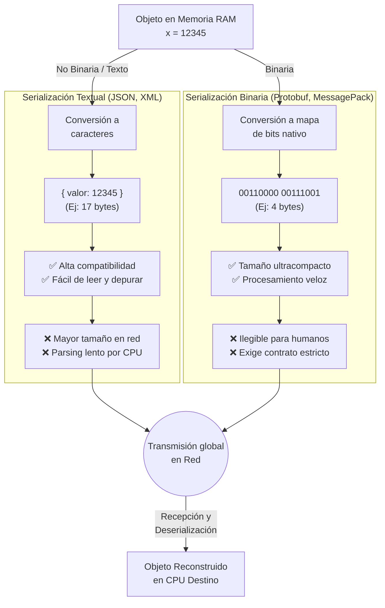

# TP4: Infraestructura de servicios web con perspectiva de redes

### Asignatura: Redes de Computadoras

**Facultad de Ciencias Exactas, Físicas y Naturales (UNC)**

---

* **Grupo:** The Lords of Pings
* **Profesores:** Facundo Oliva Cuneo y Santiago Martin Henn

---

### Integrantes y Contacto

| Nombre y Apellido | Correo Electrónico |
| :--- | :--- |
| **Pablo Castilla** | _pablo.castilla@mi.unc.edu.ar_ |
| **Javier A. Fatu** | _javier.fatu@mi.unc.edu.ar_ |
| **Enzo L. Laura Surco** | _enzo.laura.surco@mi.unc.edu.ar_ |
| **Saqib D. Mohammad Cabrejos** | _saqib.mohammad@mi.unc.edu.ar_ |


## Desarrollo

### 1) Sabemos que la información viaja a través de internet “empaquetada” según el protocolo de capa de transporte que utilicemos. Sin embargo, dentro de la carga útil de estos paquetes, la información debe estar organizada para poder realizar una interpretación correcta de su significado.

#### a) ¿Qué es la serialización en redes de computadoras?

La serialización es el proceso de transformar una estructura de datos compleja o el estado de un objeto (alojado en la memoria RAM con sus respectivos punteros y referencias) en un formato lineal estandarizado. Este formato permite que la información sea transmitida de forma eficiente a través de una red o almacenada de forma persistente.

A modo de analogía, imagina que tienes un mueble ensamblado en tu casa (el objeto en memoria) y deseas enviarlo por correo. Dado que su volumen y forma irregular complican el transporte, la solución práctica es desarmarlo. La serialización equivale a desmontar este mueble y empaquetar sus piezas ordenadamente en una caja plana (una secuencia de bytes) para su envío. Al recibir el paquete, el destinatario realiza el proceso inverso (deserialización) para ensamblar el mueble y lograr utilizarlo.

Dado que el medio físico de transmisión de la red opera exclusivamente con un flujo de bits, la serialización actúa como el mecanismo de traducción que permite, por ejemplo, que un diccionario de datos complejo generado en Python sea transmitido, recibido e interpretado correctamente por una aplicación desarrollada en C++.


_**Figura 1.** Serialización y deserialización de objetos a XML en diferentes lenguajes de programación_

#### b) ¿Cuál es la diferencia entre serialización binaria y no binaria? Buscar ejemplos, ventajas y desventajas de cada una.

La distinción fundamental entre ambos enfoques reside en la codificación de los datos. La serialización no binaria (o basada en texto) prioriza la legibilidad del mensaje para el ser humano, mientras que la serialización binaria se enfoca en maximizar la eficiencia computacional y la velocidad de transmisión.

A continuación, se detalla la comparativa técnica entre ambas alternativas:

**Serialización No Binaria (Basada en Texto)**

* Emplea esquemas de codificación de caracteres estándar (comúnmente ASCII o UTF-8).
* **Ejemplos comunes:** JSON, XML, YAML.

**Ventajas:**

* **Legibilidad humana:** Permite la inspección visual directa del tráfico de red o de los archivos generados, facilitando considerablemente las tareas de depuración (_debugging_).
* **Alta compatibilidad:** La mayoría de los lenguajes de programación modernos incluyen soporte nativo o librerías estandarizadas para el análisis sintáctico (_parsing_) de texto plano.

**Desventajas:**

* **Mayor tamaño de carga útil (_Overhead_):** Requiere un mayor volumen de datos para su transmisión debido a la inclusión obligatoria de caracteres sintácticos o estructurales (como llaves `{}` o comillas `""` en JSON).
* **Mayor costo de procesamiento:** La conversión de secuencias de texto a tipos de datos nativos en memoria demanda una cantidad superior de ciclos de CPU, ralentizando el proceso.

**Serialización Binaria**

* Transforma los datos directamente a un formato de bytes compacto y matemáticamente optimizado, prescindiendo de caracteres imprimibles.
* **Ejemplos comunes:** Protocol Buffers (Protobuf de Google), MessagePack, BSON (utilizado por MongoDB), FlatBuffers.

**Ventajas:**

* **Eficiencia espacial:** Reduce drásticamente el tamaño de la _payload_. Por ejemplo, un número entero de gran magnitud se transmite empleando sus respectivos 4 u 8 bytes, en lugar de incurrir en el costo de un byte por cada dígito decimal.
* **Alta velocidad de ejecución:** Los procesos de serialización y deserialización son notablemente ágiles, dado que la estructura de los datos transmitidos se aproxima significativamente a su representación nativa en la memoria RAM.

**Desventajas:**

* **Ilegibilidad directa:** El flujo de datos capturado carece de sentido para un observador no asistido y se visualiza como un conjunto de caracteres sin formato. Su interpretación exige el uso de herramientas de decodificación específicas.
* **Complejidad de implementación:** Usualmente demanda la definición técnica de un "esquema" estricto (o contrato previo) entre el cliente y el servidor, indispensable para establecer los límites y el tipo de dato de cada variable transmitida.



### 2) Despliegue de un servidor TCP multi-hilo

_Nota: Esta actividad se realizó de forma presencial, conectándonos a un servidor desplegado sobre una máquina virtual en clase para uso compartido._

#### a) Serialización de paquetes en formato JSON y envío mediante PacketSender

Para interactuar con el servidor, estructuramos los datos a enviar utilizando el formato JSON. Con ese propósito, creamos un archivo local denominado `payload.json` con la siguiente estructura:

```json
{
  "group": "The Lords of Pings",
  "payload": "Jueves 14 de Mayo TP4"
}
```

Es importante destacar que las claves del objeto JSON (`group` y `payload`) deben respetar estrictamente esta nomenclatura, ya que la lógica del servidor está programada para parsear y validar la información bajo ese esquema específico.

**Configuración y envío a través de PacketSender**

Para realizar la transmisión de los datos, empleamos la herramienta PacketSender. Durante la configuración, asignamos un nombre a nuestro paquete e ingresamos su contenido en formato ASCII. Adicionalmente, configuramos los parámetros de red provistos por la VM del profesor para alcanzar el servidor (Dirección IP: `34.68.162.122`, Puerto: `5050`). 

Se optó por habilitar la opción _"Persistent TCP"_ para mantener la conexión abierta luego de enviar el primer paquete, evitando la sobrecarga (Handshake) de abrir y cerrar conexiones TCP por cada mensaje subsiguiente.


_**Figura 2.** Configuración de los parámetros de transmisión TCP en PacketSender._

Utilizando el editor multilínea de PacketSender, pudimos corroborar de antemano que la carga útil (payload) mantuviera su estructura JSON intacta antes de salir a la red:


_**Figura 3.** Verificación estructural del payload JSON previo a su envío._

Finalmente, al ejecutar el envío, validamos el éxito de la comunicación. Como se aprecia en la captura de la consola del servidor general, este último recibió íntegro nuestro paquete, logró deserializarlo y nos respondió satisfactoriamente confirmando la recepción y mostrando en pantalla lo emitido por nuestro grupo.


_**Figura 4.** Recepción exitosa del paquete por parte del servidor._


_**Figura 5.** Recepción exitosa de un nuevo paquete por parte del servidor._


### 3) Desarrollo de una aplicación cliente por consola

En esta etapa, nuestro grupo desarrolló un _script_ en Python que actúa como cliente. Para lograrlo, hicimos uso de las librerías nativas `socket` (para manejar la comunicación de red) y `json` (para serializar la información antes de transmitirla).

#### a) Configuración de IP, puerto y establecimiento de la conexión

El cliente debe instanciar un socket TCP (IPv4) y apuntar hacia la dirección y el puerto donde el servidor se encuentra escuchando. 

```python
import socket
import json

HOST = "34.68.162.122"  
PORT = 5050          

client = socket.socket(socket.AF_INET, socket.SOCK_STREAM)
client.connect((HOST, PORT))
```

#### b) Serialización de la información al formato admitido por el servidor

Puesto que la lógica del servidor exige que el ingreso de datos esté bajo la estructura de un documento JSON específico, empaquetamos la entrada del usuario en un diccionario de Python y utilizamos la función `json.dumps()` para serializarlo a texto, antes de codificarlo a binario y enviarlo por la red.

```python
message = {
    "group": "The Lords of Pings",
    "payload": user_input
}

client.sendall(json.dumps(message).encode("utf-8"))
```

#### c) Ejecución del cliente y verificación de entrega

El _script_ está diseñado con un bucle continuo (`while True`) que, tras establecer la conexión, solicita texto por consola para enviarlo iterativamente. Este enfoque de interacción bidireccional continua nos aproxima a la dinámica de un chat.

```python
while True:
    user_input = input("Ingresa tu mensaje (o escribe 'adios' para salir): ")

    if user_input.strip().lower() == 'adios':
        print("Cerrando conexión...")
        client.close()
        break

    message = {
        "group": "The Lords of Pings",
        "payload": user_input
    }

    client.sendall(json.dumps(message).encode("utf-8"))
```

Al ejecutar el comando en la terminal, se establece la conexión TCP y el cliente se pone a la escucha aguardando interactividad.


_**Figura 6.** Inicialización del cliente en consola esperando la primera entrada del usuario._

Luego, transmitimos un conjunto de mensajes de prueba ("hello chicos", "buena suerte a todos", etc.) para validar la fiabilidad de la conexión bidireccional, manteniendo la sesión TCP abierta y finalizando el intercambio con la palabra clave de escape.


_**Figura 7.** Transmisión interactiva de múltiples paquetes secuenciales y proceso de cierre de conexión._

Finalmente, verificamos la salida de la pantalla del servidor operado por la VM del profesor. Como se evidencia en la imagen, los paquetes alcanzaron su destino por la red, el servidor fue capaz de deserializar correctamente el campo `payload` y registró los mensajes en su salida estándar, validando con éxito el funcionamiento de nuestro cliente.


_**Figura 8.** Consola del servidor docente recibiendo y procesando en tiempo real los mensajes del grupo._

### 4) Vamos a imbuir un poco de seguridad en nuestro sistema. Investiga e implementa alguna técnica de encriptación que te guste e implementar para cifrar la payload, SOLO LA PAYLOAD, de tu mensaje.

El mecanismo de seguridad seleccionado es **AES (Advanced Encryption Standard)**, implementado a través de un esquema de cifrado simétrico. Para llevar esto a cabo en Python, empleamos la librería `cryptography`, haciendo uso de la clase `Fernet`. Este módulo de alto nivel nos garantiza que el mensaje encriptado —protegido mediante AES en modo CBC y validado con HMAC— no pueda ser manipulado ni descifrado sin la clave correspondiente.

Instalamos la dependencia dentro de nuestro entorno virtual (`.venv/`) con el siguiente comando:
```bash
pip install cryptography
```

#### a) Implementa el cifrado en el lado del cliente.

A continuación, incorporamos el cifrado en nuestra aplicación cliente. En esta primera aproximación, el cliente genera una clave simétrica aleatoria para la sesión, la cual utiliza para encriptar exclusivamente el texto ingresado antes de empaquetarlo en el JSON y enviarlo por la red.

```python
import socket
import json
from cryptography.fernet import Fernet

# Generación de una clave simétrica efímera y creación del objeto cifrador
clave = Fernet.generate_key()
cipher = Fernet(clave)

HOST = "34.68.162.122"
PORT = 5050

client = socket.socket(socket.AF_INET, socket.SOCK_STREAM)
client.connect((HOST, PORT))

while True:
    user_input = input("Ingresa tu mensaje (o escribe 'adios' para salir): ")
    
    # Encriptamos la cadena (previamente codificada a flujo de bytes)
    user_input_encrypted = cipher.encrypt(user_input.encode("utf-8"))

    if user_input.strip().lower() == 'adios':
        print("Cerrando conexión...")
        client.close()
        break

    message = {
        "group": "The Lords of Pings",
        # Decodificamos el resultado (bytes) a string para usarlo mediante JSON
        "payload": user_input_encrypted.decode("utf-8")
    }

    client.sendall(json.dumps(message).encode("utf-8"))
```

Al ejecutar este cliente modificado, ingresamos los mensajes por consola tal como lo hacíamos en las pruebas anteriores. Desde la perspectiva del usuario emisor, la interacción se percibe idéntica a la sección 3.


_**Figura 9.** Interacción en consola desde el lado emisor en texto plano._

#### b) Verificar que la carga útil llega cifrada al servidor.

Al revisar la salida en el servidor, comprobamos que el campo `payload` ha arribado y sido impreso como una extensa cadena de caracteres ofuscados (texto cifrado codificado en base64url). Dado que el servidor carece de la clave simétrica generada aleatoriamente por nuestro cliente, le fue matemáticamente imposible recuperar el mensaje original.


_**Figura 10.** El servidor logra parsear estructuralmente el JSON emitido por el grupo, pero refleja una "payload" ilegible debido al encriptado AES._


#### c) Documentar las principales características de la técnica de cifrado que utilizaste.

Como se dijo al inicio de la sección 4, para proteger nuestra carga útil, implementamos **Cifrado Simétrico** utilizando el algoritmo **AES (Advanced Encryption Standard)** a través de la especificación **Fernet** (provista por la librería `cryptography`). 

A continuación, detallamos los conceptos teóricos y sus principales características técnicas aplicadas a nuestro código:

* **Cifrado Simétrico:** Se denomina "simétrico" porque el sistema emplea exactamente la misma clave criptográfica tanto para encriptar los datos (en el cliente) como para desencriptarlos (en el servidor). Esto implica que ambos nodos de comunicación deben conocer y compartir esta clave secreta de antemano para lograr un intercambio exitoso.
* **Estándar AES:** Es uno de los estándares de cifrado por bloques más robustos y veloces de la actualidad. En la implementación de Fernet, AES opera con claves de 128 bits en modo **CBC (Cipher Block Chaining)**. Este modo utiliza un vector de inicialización aleatorio (IV) generado para cada operación de cifrado, garantizando que incluso si se transmite el mismo mensaje dos veces, el resultado cifrado será completamente diferente en cada ocasión, evitando la detección de patrones por parte de un atacante.
* **Autenticación e Integridad (HMAC-SHA256):** Fernet no solo cifra la información, sino que además incorpora un mecanismo de autenticación mediante _HMAC-SHA256_, permitiendo verificar tanto la integridad como la autenticidad del mensaje recibido. De esta manera, si un tercero intercepta y modifica aunque sea un único bit del _payload_ JSON, el servidor detectará inmediatamente la alteración y rechazará el mensaje durante el proceso de validación.
* **Formato de salida seguro:** Fernet empaqueta automáticamente la información cifrada utilizando codificación **Base64 URL-safe** (`base64url`), permitiendo transformar la secuencia de bytes cifrados en una cadena de texto compatible con estructuras JSON y transmisiones de red sin corromper el formato del mensaje.

* **Abstracción segura:** El uso de Fernet simplifica la implementación segura de criptografía simétrica, ya que la librería administra automáticamente detalles críticos como la generación del IV, el padding, la autenticación y el empaquetado seguro del token cifrado, reduciendo errores comunes en implementaciones criptográficas manuales.

* **Aplicación práctica en el código:**  
  La materialización de todos estos conceptos teóricos se condensa en nuestro script en el momento exacto en el que capturamos el mensaje del usuario en el cliente y ejecutamos nuestra instrucción principal:

  ```python
  user_input_encrypted = cipher.encrypt(user_input.encode("utf-8"))
  ```

  En esta única línea se ejecutan automáticamente múltiples procesos criptográficos encadenados:
  1. **Codificación a Binario:** El texto plano se convierte a una secuencia de bytes (`.encode("utf-8")`), requisito indispensable ya que los algoritmos criptográficos operan de forma nativa sobre datos binarios.
  2. **Generación de IV:** El objeto `cipher` genera internamente un Vector de Inicialización aleatorio para la operación.
  3. **Cifrado AES-CBC:** Se aplica el algoritmo de grado militar AES de 128 bits para transformar el contenido en flujo ilegible.
  4. **Firma y Empaquetado:** Se añade la firma HMAC-SHA256 validatoria y se empaqueta el token final en formato URL-safe.

---

### 5) OPCIONAL: Modifica el servidor para que sea capaz de descifrar tu carga útil. Desplega servidor y cliente en tu local, captura paquetes mostrando que los mismos están cifrados mientras viajan pero el servidor es capaz de decodificar la carga útil.

Con el objetivo de validar completamente el funcionamiento del esquema de cifrado implementado, adaptamos el servidor para que fuese capaz no solo de recibir paquetes cifrados, sino también de restaurar el contenido original de la carga útil en tiempo real.

Para concretar este objetivo, abandonamos el uso de claves simétricas efímeras generadas dinámicamente en cada ejecución y adoptamos una **clave criptográfica compartida estáticamente** entre cliente y servidor. Este enfoque representa el principio fundamental del cifrado simétrico: tanto el emisor como el receptor deben conocer previamente exactamente la misma clave secreta para poder cifrar y descifrar la información exitosamente.


#### Paso 1: Verificación de la transmisión encriptada inicial

Como primera etapa de prueba, configuramos el cliente `client.py` para que apuntara directamente a la dirección IP local de nuestro server dentro de nuestra red privada.


_**Figura 11.** Configuración de los parámetros del socket cliente apuntando hacia la dirección IP del servidor dentro de la red local._

Una vez establecida la conexión TCP y enviados los primeros mensajes interactivos, el servidor logró recibir correctamente los paquetes JSON transmitidos por el cliente. Sin embargo, debido a que la información viajaba protegida mediante cifrado AES bajo la especificación Fernet, el contenido del campo `payload` únicamente podía visualizarse como una secuencia ilegible de caracteres codificados en Base64 URL-safe. 


_**Figura 12.** El servidor recibe correctamente las estructuras JSON provenientes de la red, pero el contenido de la carga útil permanece ilegible al encontrarse con el cifrado AES._

Este comportamiento valida que los datos sensibles nunca viajan en texto plano a través del canal de comunicación.

#### Paso 2: Implementación de clave compartida y lógica de descifrado

Para permitir que el servidor recuperase el contenido original del mensaje, definimos una variable estática `CLAVE_COMPARTIDA` tanto en el cliente como en el servidor, inicializando en ambos extremos un objeto `Fernet` utilizando exactamente la misma clave secreta.

De esta manera, el cliente utiliza dicha clave para cifrar el contenido antes de transmitirlo, mientras que el servidor emplea la misma llave criptográfica para realizar el proceso inverso de descifrado.

Particularmente en el servidor, adaptamos el bucle principal de procesamiento para interceptar el contenido del campo `payload`, reconstruir los bytes cifrados y ejecutar el proceso de desencriptación:

```python
# Desencriptamos el payload que envió el cliente
try:
    # 1. Recuperamos el string cifrado y lo convertimos nuevamente a bytes
    payload_encriptado = message["payload"].encode("utf-8")
    
    # 2. Fernet ejecuta internamente múltiples validaciones de seguridad:
    # Verifica la autenticidad e integridad del token utilizando HMAC-SHA256.
    # Recupera automáticamente el Vector de Inicialización (IV) almacenado dentro del token cifrado.
    # Ejecuta el algoritmo AES-128-CBC utilizando la clave compartida.
    # Devuelve finalmente el contenido original decodificado en UTF-8.
    payload_desencriptado = cipher.decrypt(payload_encriptado).decode("utf-8")
    
    # 3. El contenido vuelve a ser texto legible para la consola
    print(f"{message['group']}: {payload_desencriptado}")

except Exception as e:
    print(f"Error al desencriptar mensaje recibido: {e}")
```

Una vez reiniciados ambos procesos, el flujo de comunicación funcionó correctamente: el cliente continuó transmitiendo información cifrada a través de la red mientras que el servidor logró reconstruir e imprimir el contenido original en tiempo real.


_**Figura 13.** Cliente enviando mensajes cifrados mediante Fernet utilizando una clave simétrica compartida._


_**Figura 14.** El servidor ejecuta exitosamente decrypt(), recuperando el contenido original de los mensajes enviados ("hello", "que genial", etc.)._

#### Paso 3: Análisis y auditoría de tráfico en la red (Wireshark)

Como validación experimental final del mecanismo de protección implementado, realizamos una captura de tráfico utilizando Wireshark sobre la interfaz de loopback local, filtrando exclusivamente los paquetes pertenecientes al canal TCP utilizado por nuestra aplicación.

```text
tcp.port == 5050
```

**Paquete inspeccionado:**


_**Figura 15.** Inspección de una trama TCP mediante Wireshark. El campo payload permanece completamente cifrado durante la transmisión, mientras que únicamente la metadata no sensible (group) puede visualizarse en texto plano._

La captura evidencia que la información sensible jamás circula en formato legible dentro del canal de comunicación. Incluso interceptando directamente los paquetes de red, un atacante únicamente observaría tokens cifrados protegidos mediante AES, autenticados mediante HMAC-SHA256 y codificados en Base64 URL-safe, imposibilitando la recuperación del contenido original sin poseer previamente la clave criptográfica compartida.
